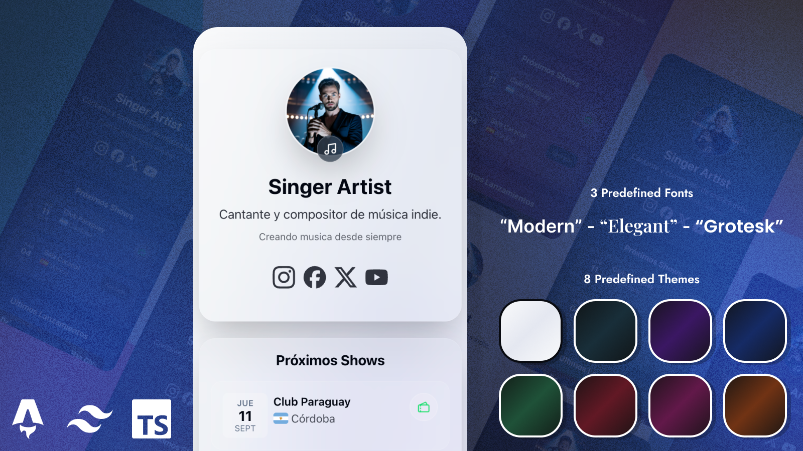

# ArtisTree – Link in Bio Page for Artists 🎶

[](LICENSE)
[](https://astro.build/)
[](https://tailwindcss.com/)
[](https://app.netlify.com/projects/artistree-astro/deploys)



ArtisTree is a customizable landing page for music artists.
It works like a modern “link-in-bio” for social networks: centralizing links to your platforms (Spotify, Apple Music, YouTube, etc.), upcoming shows, releases, and booking contacts.

Built with [Astro](https://astro.build/) + TailwindCSS v4, and designed to be easily configured via a single file: `src/data/site.json`.

## 🚀 Demo

👉 [View demo](https://artistree-astro.netlify.app/)

---

## 🚀 Quick Start

This project uses `pnpm`, but you can use `npm` without issues. The official lockfile is `pnpm-lock.yaml`.

1. Clone the repository

   ```bash
   git clone https://github.com/francosuarez-dev/artistree.git
   cd artistree
   ```

2. Install dependencies

   ```bash
   pnpm install
   ```

3. Start the development server

   ```bash
   pnpm dev
   ```

   The site will be available at `http://localhost:4321`

4. Production build
   ```bash
   pnpm build
   pnpm preview
   ```

---

## 📦 Configuration via `site.json`

All configuration is centralized in:

```
src/
  data/
    site.json   ← edit everything here
```

> Advanced alternative: if you want Astro’s optimized image imports, you can use `src/data/site.ts` and export a typed object (see the Images section).

---

## 🧰 General Structure

```jsonc
{
  "config": {
    "title": "Artistree Landing",
    "description": "Landing built with Astro",
    "theme": "violet", // one of: light | dark | violet | blue | green | red | pink | orange
    "copyright": "© 2025 ..."
  },

  "artist": {
    "name": "Franco Suárez",
    "description": "Singer and songwriter...",
    "bio": "Short text...",
    "picture": "/covers/profile.jpeg" // see Images section
  },

  "socials": {
    "instagram": "https://instagram.com/...",
    "facebook": "https://facebook.com/...",
    "x": "https://x.com/...",
    "youtube": "https://youtube.com/..."
    // optional: spotify, applemusic, tidal, whatsapp, email, website ...
  },

  "booking": {
    "email": "booking@franco.com",
    "phone": "+54 911 2345 6789"
  },

  "shows": [
    {
      "title": "Show name",
      "date": "2025-09-12", // ISO YYYY-MM-DD
      "city": "Córdoba",
      "country": "AR", // ISO 3166-1 alpha-2 → renders the flag
      "venue": "Club Paraguay",
      "tickets": "https://tickets...", // optional
      "available": true // if false → shows “Sold Out”
    }
  ],

  "releases": [
    {
      "title": "Noche Eterna",
      "album": "Noche Eterna Album",
      "releaseDate": "2025-08-15", // ISO YYYY-MM-DD (used for sorting)
      "cover": "/covers/cover1.jpeg",
      "links": {
        "spotify": "https://open.spotify.com/track/...",
        "applemusic": "https://music.apple.com/...",
        "youtube": "https://www.youtube.com/watch?v=XXXXXXXXXXX"
      }
    }
  ]
}
```

---

## 🎨 Theme

- Defined in `config.theme`.
- Valid values: `light | dark | violet | blue | green | red | pink | orange`.
- The layout applies `data-theme={config.theme}`, and Tailwind v4 picks colors/gradients from `globals.css`.

---

## ✍️ Fonts

- Defined in `config.font`.
- Valid values: `modern | elegant | grotesk`.
- The layout applies `data-font={config.font}` on `<html>` and styles are sourced from `globals.css`.
- Each preset automatically loads its typefaces from Google Fonts:

  - **modern** → Inter (text and headings)
  - **elegant** → Inter (text) + Playfair Display (headings)
  - **grotesk** → Poppins (text and headings)

> You can add more presets by editing the `FONT_LINKS` map in `Layout.astro` and the `:root[data-font="..."]` blocks in `globals.css`.

---

## 👤 Artist

- `name`, `description`, `bio` → free-form strings.
- `picture` → see **Images** below.

---

## 🔗 Socials

- Supported keys (you can add more):
  `instagram, facebook, x, spotify, applemusic, tidal, youtube, whatsapp, email, website`
- The UI maps each key to an icon (yours, in `src/icons`).
- Only entries with a URL/value are rendered.

Examples of values:

- `email`: `"mailto:contact@..."`
- `website`: `"https://yoursite.com"`
- `whatsapp`: `"+5491123456789"` (the UI may convert to `https://wa.me/...` if implemented that way)

---

## 🎫 Booking

- Contact section for bookings.
- If there is `email` → “Email” button (`mailto:`).
- If there is `phone` → “Phone” button (`tel:`).
- If both exist → both are shown.

```json
"booking": { "email": "booking@...", "phone": "+54 911 2345 6789" }
```

---

## 📅 Shows (calendar, flag, and tickets)

Fields per show:

- `title` (optional, informational)
- `date` (**ISO `YYYY-MM-DD`**) → formatted with locale `es-AR` and displayed in a calendar-style card (day / date / month)
- `city`, `venue` → text
- `country` → **ISO 3166-1 alpha-2 code** (`AR`, `ES`, `US`…)
  Used with **flag-icons:** `<span class="fi fi-ar"></span>`
- `tickets` (optional) + `available` (**boolean**):
  - `tickets` + `available: true` → **Tickets** button
  - `tickets` + `available: false` → **Sold Out** (no link)
  - without `tickets` → no action is shown

The shows list filters future dates and sorts ascending by date.

---

## 💿 Releases (with “latest release” and YouTube video)

Each release:

- `title` (string)
- `album` (string)
- `releaseDate` (**ISO `YYYY-MM-DD`**) → used for **sorting** (desc)
- `cover` (string) → image path
- `links` (object):
  - typical keys: `spotify`, `applemusic`, `deezer`, `tidal`, `youtube`, etc.
  - **"Featured" behavior**: the most recent (by `releaseDate`) is shown first;
    if it also has `links.youtube`, the **video is embedded** instead of the cover (with a fallback “Open on YouTube” if embedding isn’t available on mobile)
  - The rest of the releases are shown as regular cards with cover + platform icons

---

## 🔗 Custom Links

In addition to basic social networks (`socials`), you can define a list of custom links in `site.json`:

````json
"links": [
  {
    "label": "Personal Instagram",
    "description": "Personal Instagram profile",
    "url": "https://instagram.com/user",
    "icon": "website"
  },
  {
    "label": "Label Instagram",
    "description": "Record label Instagram profile",
    "url": "https://instagram.com/label",
    "icon": "instagram",
    "cover": "./img/profile.jpeg"
  },
  {
    "label": "YouTube",
    "description": "Artist YouTube channel",
    "url": "https://www.youtube.com/channel/...",
    "icon": "youtube"
  }
]

````

### Available fields

- label: Name of the link to display
- description: Short descriptive text
- url: Full URL of the link
- icon: Icon name (e.g., instagram, youtube, website, tiktok, etc.)
- cover (optional): Custom image
- If `cover` is present, it replaces the icon

---

## 🖼️ Images (covers / profile)

You have two options:

### Option A – JSON + `public/` (simple)

- Place images in `public/covers/...`
- Use absolute paths in JSON:
  `"cover": "/covers/noche-eterna.jpg"`, `"picture": "/covers/profile.jpeg"`

### Option B – Optimized imports (advanced)

- Replace `src/data/site.json` with `src/data/site.ts`
- Import covers so Astro generates optimized URLs:

```ts
// src/data/site.ts
import cover1 from "../assets/covers/cover1.jpeg";
import profile from "../assets/covers/profile.jpeg";

export default {
  artist: { picture: profile },
  releases: [{ title: "Track", cover: cover1 /* ... */ }],
};
````

---

## ✅ Recommended rules and validations

- **Dates** (`date`, `releaseDate`): use ISO `YYYY-MM-DD`
- **Country** (`country` in shows): use ISO alpha-2 (e.g., `AR`, `ES`, `US`)
- **Links**:
  - `email` as `mailto:...`
  - `phone` as a readable number; the UI trims spaces for `tel:`
  - `youtube` can be `watch?v=…`, `youtu.be/…` or `shorts/…` (the parser extracts the ID)
- **Theme** (`config.theme`): use one of those defined in `globals.css`

---

## 🛠️ How it maps to the UI (summary)

- `config.theme` → `<html data-theme="...">` (applies theme colors/gradients)
- `artist.*` → header/profile
- `socials` → `SocialIcons` maps key → icon and renders only those present
- `booking` → shows Email / Phone buttons as available
- `shows` → calendar card + flag (flag-icons) + Tickets/Sold Out action
- `releases` → sorted DESC by `releaseDate`; the first is featured and, if `links.youtube` exists, the video is embedded; the rest in a grid

---

## 🧪 Quick checklist

- [ ] Is `config.theme` a valid one?
- [ ] Do images point to `/covers/...` in `public/` or are you using `site.ts` with imports?
- [ ] Is each show’s `country` a 2-letter ISO code?
- [ ] Dates in `YYYY-MM-DD` format?
- [ ] Does `releases[0]` (the newest) have `links.youtube` if you want the embedded video?

---

## ❓ FAQ

- The flag doesn’t appear: ensure `country` is ISO alpha-2 (e.g., `BR`, not `BRA`).
- YouTube embed says “not available” on mobile: some music videos block embedding. The UI shows an “Open on YouTube” button as a fallback.
- I want to add another social platform: create the `.astro` icon, add it to the `SocialIcons` map, and add the key under `socials` in the JSON.

